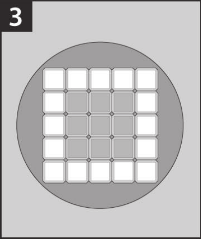

# Proyecto Final

| Curso    | Programación Avanzada en Web |
| :------- | :--------------------------- |
| Código   | SC-701                       |
| Periodo  | III Cuatrimestre 2025        |
| Profesor | Luis Andrés Rojas Matey      |
| Valor    | 50 %                         |

 

- [Introducción](#introducción)
- [Objetivo](#objetivo)
- [Especificaciones funcionales](#especificaciones-funcionales)
  - [Jugar una partida nueva](#jugar-una-partida-nueva)
    - [Modo para dos jugadores](#modo-para-dos-jugadores)
    - [Modo para cuatro jugadores](#modo-para-cuatro-jugadores)
  - [Mostrar y exportar una partida finalizada](#mostrar-y-exportar-una-partida-finalizada)
  - [Mostrar estadísticas](#mostrar-estadísticas)
- [Especificaciones técnicas](#especificaciones-técnicas)
- [Entregables](#entregables)
- [Evaluación](#evaluación)

 

## Introducción

El juego de mesa [**Quixo**](https://misutmeeple.com/2023/10/resena-quixo) es una evolución del clásico **Tic-tac-toe** (conocido popularmente como "gato"). Es para dos o cuatro jugadores y consiste en crear una línea de cinco **cubos** de un mismo símbolo en un tablero.

 

## Objetivo

Aplicar los conocimientos adquiridos para desarrollar una aplicación web del juego **Quixo**.

 

## Especificaciones funcionales

Al ejecutar la aplicación web, se le deben proveer tres opciones al usuario:

1. Jugar una partida nueva.

2. Mostrar y exportar una partida finalizada.

3. Mostrar estadísticas.

 

### Jugar una partida nueva

Cuando el usuario selecciona esta opción, se le solicitará que escoja uno de los dos modos de juego:

- Para dos jugadores.
- Para cuatro jugadores.

Una vez que se indique el modo de juego, se desplegará un tablero de 5x5, colocando 25 **cubos** en el mismo. Cada **cubo** se caracteriza por su cara superior, el cual podrá tener alguno de estos tres símbolos: `neutro`, `círculo` o `cruz` (ver Figura # 1). Así mismo, cuando sea `círculo` o `cruz`, tendrá dibujado un `punto`, el cual será importante para el modo de juego para cuatro jugadores, no así para el modo de juego para dos jugadores.

Al principio de la partida, se colocan todos los **cubos** con símbolo `neutro` (ver Figura # 2). Para efectos prácticos, solo la cara superior del **cubo** es necesario desplegar.

En todo momento de la partida, debe haber otros dos elementos presentes en la página:

- Un reloj con el tiempo transcurrido mostrando las horas, minutos y segundos transcurridos de la partida, utilizando el formato `##:##:##`, donde cada número (`#`) debe simular un [visualizador de siete segmentos](https://es.wikipedia.org/wiki/Visualizador_de_siete_segmentos) y se debe actualizar cada segundo.

- Un botón que permita reiniciar la partida actual, sobreescribiéndola.

 

#### Modo para dos jugadores

Los identificadores de los jugadores se deben mostrar a los lados superior e inferior del tablero, es decir, arriba y abajo. El del primer jugador será en la parte de arriba, mientras que el del segundo en la parte de abajo. El primer jugador utilizará el símbolo `círculo`, por lo que el segundo usará el de `cruz`.

Por turnos, cada jugador elige un **cubo** y lo desplaza según las siguientes reglas:

- En ningún caso un jugador puede pasar su turno.

- El jugador elige y retira un **cubo** `neutro` o con su símbolo (`círculo` o `cruz`) de la periferia del tablero (ver Figura # 3).

- Durante la primera vuelta de juego, los jugadores tienen la obligación de retirar un **cubo** con símbolo `neutro`.

- Nunca se puede retirar un **cubo** con el símbolo del contrario.

- Sin importar que se trate de un **cubo** `neutro` o con el símbolo del jugador (`círculo` o `cruz`), siempre se colocará con el símbolo del jugador.

- El jugador coloca el **cubo** en uno de los extremos que elija de las filas incompletas creadas al retirar el **cubo**: empuja el extremo y coloca el **cubo** (ver Figura # 4).

- Nunca se puede colocar el **cubo** jugado en el lugar del que fue retirado.

- El ganador es el jugador que logra crear una línea horizontal, vertical o diagonal de cinco **cubos** con su símbolo (ver Figura # 5).

- Un jugador que crea una línea con el símbolo del jugador contrario, pierde la partida, incluso si al mismo tiempo crea una línea con su símbolo.

Una vez finalizada la partida, el identificador del jugador que ganó se debe indicar y no se podrán hacer más movimientos. Así mismo, el reloj de tiempo transcurrido se debe detener.

 

#### Modo para cuatro jugadores

Para este modo, se forman dos equipos llamados **A** y **B**, cada uno de dos jugadores. El equipo **A** estará conformado por el primer y tercer jugadores, mientras que el equipo **B** será constituido por el segundo y cuarto jugadores. El equipo **A** usa el símbolo `círculo` y el equipo **B** utiliza el símbolo `cruz`.

Los identificadores de los jugadores estarán distribuidos en el tablero de la siguiente forma:

- El del primer jugador (del equipo **A**) arriba del tablero.
- El del segundo jugador (del equipo **B**) a la derecha del tablero.
- El del tercer jugador (del equipo **A**) abajo del tablero.
- El del cuarto jugador (del equipo **B**) a la izquierda del tablero.

Es otras palabras, los jugadores se colocan unos frente a otros (ver Figura # 6) y juegan por turnos en el sentido de las agujas del reloj, según el orden establecido.

Por turnos, cada jugador elige un **cubo** y lo desplaza según las siguientes reglas:

- El jugador elige y retira un **cubo** `neutro` o un **cubo** con su símbolo (`círculo` o `cruz`), de la periferia del tablero, pero solo si el `punto` está orientado hacia él; es decir, la orientación del `punto` determina quién del equipo puede jugar el **cubo** (ver Figura # 7, donde **V** y **W** solo pueden ser jugados por el jugador **A1**, mientras que **X**, **Y** y **Z** solo pueden ser jugados por el jugador **A2**).

- En la primera vuelta de juego, los jugadores tienen la obligación de retirar un **cubo** `neutro`.

- Nunca se puede retirar un **cubo** con el símbolo del contrario.

- Ya sea que se trate de un **cubo** `neutro` o con el símbolo del jugador, siempre se colocará con el símbolo del jugador; así mismo, el jugador decidirá la orientación del `punto` de forma que determine cuál de los dos jugadores del equipo podrá volver a jugar el **cubo**.

- El jugador coloca el **cubo** en uno de los extremos de su elección de las filas incompletas creadas al retirar el **cubo**: empuja el extremo y coloca el **cubo** (ver Figura # 4).

- Nunca se puede colocar el **cubo** jugado en el lugar del que fue retirado.

- Un jugador tiene la obligación de jugar cuando le toque el turno, salvo si no puede retirar de la periferia del tablero un **cubo** `neutro`, o de su símbolo con el `punto` orientado hacia él.

- El ganador es el equipo que logra crear una línea horizontal, vertical o diagonal de cinco **cubos** con su símbolo, sea cual sea la orientación del `punto` en los **cubos**. El equipo que crea una línea con el símbolo del contrario pierde la partida, incluso si al mismo tiempo crea una línea con su símbolo.

Una vez finalizada la partida, el equipo que ganó se debe indicar y no se podrán hacer más movimientos. Así mismo, el reloj de tiempo transcurrido debe detenerse.

 

### Mostrar y exportar una partida finalizada

Cuando el usuario escoge esta opción, se debe ver la lista de todas las partidas finalizadas. Esta lista debe contener las fechas y horas de las partidas al momento de crearse o sobreescribirse, los tiempos transcurridos, además de estar ordenada en forma descendente por fecha y hora de creación.

En esta sección, el usuario debería ser capaz de efectuar estas actividades:

- Ver el historial de la partida, desplegando un área de juego con todo el historial de jugadas, donde el usuario puede navegar por cada una y ver cómo se ha desarrollado la partida, incluyendo el reloj del tiempo transcurrido.

- Guardar una de las partidas a un archivo [XML](https://developer.mozilla.org/es/docs/Web/XML/Guides/XML_introduction). El nombre y ubicación de este archivo se le debe preguntar al usuario y debe contener todo lo relacionado a la partida: modo de juego, fecha y hora de creación, estado final, historial, etc.

 

### Mostrar estadísticas

Estas son dos tablas que muestran tanto las listas de jugadores (del modo para dos jugadores) como de equipos (del modo para cuatro jugadores). Estas tablas deben incluir la efectividad (porcentaje de partidas ganadas) y la cantidad de partidas ganadas. Por ejemplo:

- Modo para dos jugadores:

| Jugador | Efectividad | Ganadas |
| :-----: | :---------: | :-----: |
| Primero |    75 %     |   15    |
| Segundo |    25 %     |    5    |

- Modo para cuatro jugadores:

| Equipo | Efectividad | Ganadas |
| :----: | :---------: | :-----: |
|   A    |    20 %     |    5    |
|   B    |    80 %     |   20    |

 

## Especificaciones técnicas

Esta es una aplicación web, por lo que debe ejecutarse en un navegador web.

Se puede utilizar cualquier _framework_ web de arquitectura **SPA** (_Single-Page Application_) como por ejemplo [Angular](https://angular.dev) o [Vue.js](https://vuejs.org), o bien, **MPA** (_Multi-Page Application_) como [ASP.NET Core](https://dotnet.microsoft.com/en-us/apps/aspnet) o [PHP](https://www.php.net).

Para la persistencia de los datos, se debe utilizar una base de datos. Esta base de datos puede ser de tipo **SQL** (como por ejemplo [MySQL](https://www.mysql.com) o [PostgreSQL](https://www.postgresql.org)) o **NoSQL** (como [MongoDB](https://www.mongodb.com) o [Firestore](https://firebase.google.com/docs/firestore)), debe estar guardada (o ejecutándose) en el "lado del servidor" (incluso en un **DBaaS** o _Database as a Service_), y puede ser de tipo "un solo archivo" (como [SQLite](https://sqlite.org) o [DuckDB](https://duckdb.org)) o bien como parte de un sistema de gestión de bases de datos (como [MariaDB](https://mariadb.org) o [SQL Server](https://www.microsoft.com/en-us/sql-server/sql-server-downloads)). Es posible también utilizar (aunque no es requerido) cualquier conector, intermediario, biblioteca, paquete, módulo o herramienta para la comunicación con la base de datos (como por ejemplo [Entity Framework](https://learn.microsoft.com/en-us/ef)).

Así mismo, se puede utilizar cualquier _framework_ de CSS disponible, o bien, se pueden usar estilos propios.

Para la página web, se puede utilizar cualquier elemento HTML para la representación del tablero (como por ejemplo `<table>`). También, es posible utilizar cualquier elemento para la escogencia de los **cubos** por parte del jugador (así como la dirección del `punto` en modo para cuatro jugadores), pero esta escogencia debe ser con clics.

 

## Entregables

Debido a que este proyecto se debe hacer según los grupos establecidos, el único entregable (es decir, lo único que se debe subir al **Campus Virtual**) es el vínculo (_link_) al repositorio en línea de **Git** (como por ejemplo, a [GitHub](https://github.com) o [GitLab](https://about.gitlab.com)). Este vínculo debe ser subido por <ins>solo uno de los miembros del grupo</ins>. Este repositorio puede ser privado pero <ins>deberá ser público</ins> al momento que les llegue el turno de la exposición del proyecto (ya sea en la semana 14 o 15), para que el profesor pueda tener acceso al mismo.

En el repositorio debe estar lo siguiente:

- Todo el código fuente del proyecto, excepto los archivos compilados.

- Un archivo `README.tex` (y su correspondiente `README.pdf`) hecho con [LaTeX](https://www.latex-project.org) en la raíz del proyecto (<ins>ambos archivos —el `.tex` y el `.pdf`— deben ser incluidos, de lo contrario se evaluará como que no se entregó la documentación</ins>), que contenga lo siguiente:

  - Los nombres y carnés de los integrantes del grupo. <ins>Estos serán los únicos que serán tomados en cuenta para la calificación</ins>.

  - El nombre de usuario y correo de **Git** de cada integrante.

  - Una lista de los _frameworks_ utilizados, así como herramientas (por ejemplo, el motor de base de datos).

  - El tipo de aplicación (**SPA** o **MPA**).

  - La arquitectura utilizada (por ejemplo, **MVC**).

  - Un diagrama (puede utilizar, por ejemplo, [PGF](https://www.ctan.org/pkg/pgf)) de la definición de la base de datos: una base de datos **SQL** relacional tendría tablas, columnas, tipos de campos, llaves, referencias, etc.; mientras que una **NoSQL** documental tendría colecciones, documentos, tipos de campos, etc.

  - Todas las referencias de sitios webs con explicaciones, ejemplos y _snippets_ de código utilizados, así como los _prompts_ de los agentes de AI (tanto de entrada como de salida) que se hayan utilizado.

  - Un breve instructivo que incluya:

    - <ins>Instalación</ins>. Por ejemplo, para proyectos hechos con **Node.js**, la instalación de paquetes vía `npm install`.
    - <ins>Compilación o creación</ins>. Siguiendo con el ejemplo de **Node.js**, como con el comando `npm build`.
    - <ins>Ejecución</ins>. Continuando con **Node.js**, el comando para que funcione la aplicación, como `npm start` o `npm run execute` o `node script.js`.

 

## Evaluación

El proyecto será calificado según la rúbrica que se presenta en el programa del curso.
