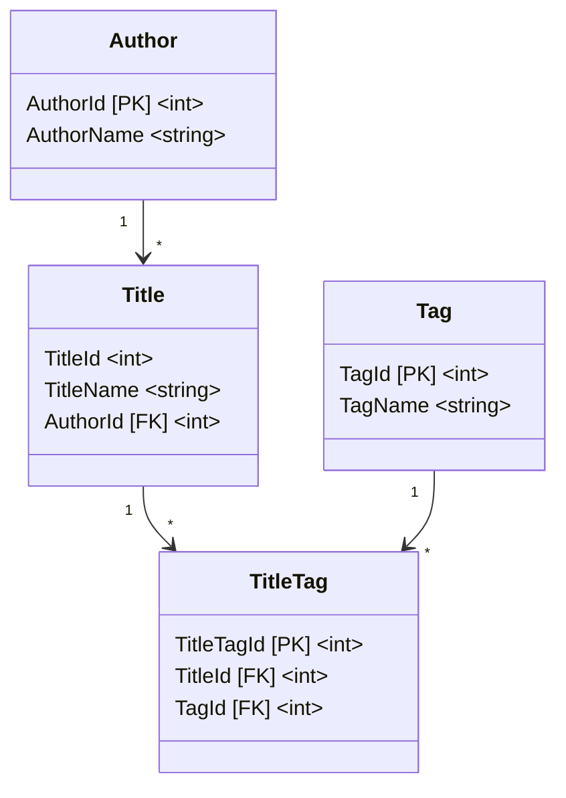

# Práctica Programada 4

| Curso                   | Programación Avanzada en Web             |
| :---------------------- | :--------------------------------------- |
| Código                  | SC-701                                   |
| Profesor                | Luis Andrés Rojas Matey                  |
| Valor                   | 4 %                                      |
| Fecha y hora de entrega | Martes 11 de noviembre antes de las 6 pm |

<br />

- [Introducción](#introducción)
- [Objetivo](#objetivo)
- [Especificaciones funcionales](#especificaciones-funcionales)
  - [Crear una base de datos relacional](#crear-una-base-de-datos-relacional)
  - [Cargar el archivo CSV provisto](#cargar-el-archivo-csv-provisto)
    - [`Authors`](#authors)
    - [`Titles`](#titles)
    - [`Tags`](#tags)
    - [`TitlesTags`](#titlestags)
  - [Guardar los archivos TSV](#guardar-los-archivos-tsv)
- [Especificaciones técnicas](#especificaciones-técnicas)
- [Entregables](#entregables)
- [Evaluación](#evaluación)

<br />

## Introducción

Muchos de los grandes clásicos de la literatura universal son de dominio público debido a que sus derechos de autor han expirado, permitiendo que legalmente puedan ser copiadas, adaptadas y distribuidas por cualquier persona o institución. Esto permite que editoriales creen sus propias versiones y las vendan o compartan.

<br />

## Objetivo

Aplicar los conocimientos adquiridos al utilizar la herramienta **Entity Framework** con la estrategia denominada _Code First_, además de investigar cómo lograr la lectura de archivos CSV (_Comma-Separated Values_) y escritura de archivos TSV (_Tab-Separated Values_), utilizando el _Framework_ **.NET 8.0**.

<br />

## Especificaciones funcionales

Se debe crear una aplicación de Consola, capaz de cumplir con las siguientes actividades:

1. Crear la base de datos relacional

2. Cargar el archivo CSV provisto

3. Guardar los archivos TSV

<br />

### Crear una base de datos relacional

El objetivo de esta sección es que el proyecto incluya todo lo necesario para la creación de una base de datos relacional de **SQLite** por medio de la estrategia _Code First_. Esto significa que se deberían poder ejecutar las siguientes instrucciones y la base de datos se crearía satisfactoriamente:

```bash
$ dotnet build
...
$ dotnet ef migrations add InitialCreate
...
$ dotnet ef database update
```

Lo anterior implica que los paquetes de **NuGet** tanto del **Entity Framework** como de **SQLite** deben estar referenciados en el archivo del _Project_ (`.csproj`).

Además, la base de datos se deberá llamar `books.db` y crearse dentro de una carpeta llamada `data` en la raíz del directorio del _Project_ (no del _Solution_).

Para utilizar la estrategia _Code First_, debe existir una única clase _Context_ (con cualquier nombre) que contenga _Entities_ que correspondan con la siguiente estructura (`[PK]` significa _Primary Key_ y serán autonuméricos, y `[FK]` corresponde a _Foreign Key_):



Como parte del proceso de creación de la base de datos, se deben hacer varios cambios a las convenciones de **Entity Framework**:

- Agregar _Data Annotations_ en cada una de las tablas para indicar que todas las propiedades serán requeridas (`NOT NULL` en las columnas de la base de datos).

- Utilizar la estrategia de _Fluent API_ para que el nombre de la tabla `TitleTag` sea `TitlesTags` en la base de datos.

- Con la estrategia de _Fluent API_, definir el orden de las columnas de la tabla `Title`:
  - `TitleId`
  - `AuthorId`
  - `TitleName`

<br />

### Cargar el archivo CSV provisto

Desde la misma carpeta `data`, se debe poder leer el archivo CSV proveído, es decir, suponer que `books.csv` estará en dicha carpeta. Este archivo fue creado a partir de la información pública de una [Biblioteca Digital](https://pruebat.org/biblioteca-digital) y contiene una lista de autores, títulos y etiquetas. Se puede observar que el archivo contiene un encabezado (primera fila) con tres columnas y las demás filas corresponden a los datos:

```csv
Author,Title,Tags
"Abenza y Rodríguez, Aureliano",Los caminos para el éxito,Ensayo|Autoayuda
"About, Edmond",La nariz de un notario,Literatura Universal
"Acosta, José de",Historia Natural y moral de las Indias,Historia y Novela histórica
"Acosta, Soledad",La mujer en la sociedad moderna,Historia y Novela histórica|Ensayo|Autoayuda
"Acuña, Manuel","Selección de poemas (Acuña, Manuel)",Literatura Hispanoamericana
"Adler, María Raquel",Místicas,Literatura Hispanoamericana
Aeschylus,The persians,Literatura Universal
Aeschylus,Prometheus bound,Literatura Universal
"Aguinaldo, Emilio",Reseña verídica de la Revolución Filipina,Literatura Universal
...>
```

Estas serían las especificaciones de cada columna:

- `Author`: el autor, usualmente con el formato "apellido, nombre". Tener en cuenta que el dato puede estar entre comillas dobles (`"..."`), debido a que su formato ("apellido, nombre") contiene una coma (`,`) y no se debe confundir con el separador de datos del formato del CSV.

- `Title`: el título del libro.

- `Tags`: las etiquetas del libro. Dichas etiquetas están separadas por _Pipes_ (`|`) en caso de que haya más de una.

Lo siguiente es un ejemplo de cómo se podrían ver las tablas de la base de datos cuando las siguientes filas son insertadas:

- `"Acosta, Soledad",La mujer en la sociedad moderna,Historia y Novela histórica|Ensayo|Autoayuda`
- `Aeschylus,The persians,Literatura Universal`
- `Aeschylus,Prometheus bound,Literatura Universal`
- `"Aguinaldo, Emilio",Reseña verídica de la Revolución Filipina,Literatura Universal`

#### `Authors`

| AuthorId |    AuthorName     |
| :------: | :---------------: |
|   ...    |        ...        |
|    4     |  Acosta, Soledad  |
|   ...    |        ...        |
|    7     |     Aeschylus     |
|    8     | Aguinaldo, Emilio |
|   ...    |        ...        |

#### `Titles`

| TitleId |                 TitleName                 | AuthorId |
| :-----: | :---------------------------------------: | :------: |
|   ...   |                    ...                    |   ...    |
|   10    |      La mujer en la sociedad moderna      |    4     |
|   ...   |                    ...                    |   ...    |
|   21    |               The persians                |    7     |
|   22    |             Prometheus bound              |    7     |
|   23    | Reseña verídica de la Revolución Filipina |    8     |
|   ...   |                    ...                    |   ...    |

#### `Tags`

| TagId |           TagName           |
| :---: | :-------------------------: |
|  ...  |             ...             |
|   2   | Historia y Novela histórica |
|   3   |           Ensayo            |
|   4   |          Autoayuda          |
|  ...  |             ...             |
|  15   |    Literatura Universal     |
|  ...  |             ...             |

#### `TitlesTags`

| TitleTagId | TitleId | TagId |
| :--------: | :-----: | :---: |
|    ...     |   ...   |  ...  |
|     3      |   10    |   2   |
|     4      |   10    |   3   |
|     5      |   10    |   4   |
|    ...     |   ...   |  ...  |
|     45     |   21    |  15   |
|     46     |   22    |  15   |
|     47     |   23    |  15   |
|    ...     |   ...   |  ...  |

Cuando se ejecuta el programa (de Consola), lo primero que debe hacer es verificar si la base de datos tiene la información guardada. De no ser así (es decir, la primera vez que se ejecuta), entonces se debe llenar la base de datos con la información del archivo CSV, tomando en cuenta lo que se indicó anteriormente.

Se puede suponer que la base de datos fue creada con anterioridad, es decir, se debe verificar que la base de datos está vacía (sin información), no que el archivo de la base de datos (`books.db`) exista. Además, el llenado de la base de datos debería efectuarse una sola vez. Por ejemplo, cuando se ejecute por primera vez la aplicación de Consola, se debe indicar que la base de datos está vacía y, por lo tanto, se debe llenar con la información correspondiente (los mensajes son solo de referencia):

```bash
$ dotnet run

La base de datos está vacía, por lo que será llenada a partir de los datos del archivo CSV.

Procesando... Listo.
```

<br />

### Guardar los archivos TSV

Cuando el programa (de Consola) se ejecuta de nuevo (porque la base de datos ya fue llenada con anterioridad), se debe leer la información de la base de datos y generar en la carpeta `data` varios archivos TSV, de la siguiente forma:

- El nombre del archivo será la primera letra del nombre completo del autor (el primer carácter de `AuthorName`, el cual es usualmente de su apellido) con la extensión del archivo correspondiente (`.tsv`). Por ejemplo: `./data/A.tsv`.

- Cada archivo tendrá tres columnas, cuyo encabezado indicará lo siguiente:

  - `AuthorName`
  - `TitleName`
  - `TagName`

- Cada fila tendrá la información referente a cada autor (`AuthorName`), título (`TitleName`) y etiqueta (`TagName`), teniendo en cuenta lo siguiente:
  - El orden de las filas será de forma descendente y estará determinado por la primera letra de cada ítem, con la siguiente prioridad:
    - Autor (mayor prioridad)
    - Título
    - Etiqueta (menor prioridad)
  - Si hay más de una etiqueta, entonces se repetirán los datos del autor (`AuthorName`) y título (`TitleName`). Por ejemplo (es posible que las comillas no sean necesarias ya que son solamente para darle claridad al ejemplo, debido al uso del separador _Tab_):

```tsv
"AuthorName"	"TitleName"	"TagName"
"Acosta, Soledad"	"La mujer en la sociedad moderna"	"Autoayuda"
"Acosta, Soledad"	"La mujer en la sociedad moderna"	"Ensayo"
"Acosta, Soledad"	"La mujer en la sociedad moderna"	"Historia y Novela histórica"
"Aeschylus" "Prometheus bound"  "Literatura Universal"
"Aeschylus" "The persians"  "Literatura Universal"
"Aguinaldo, Emilio" "Reseña verídica de la Revolución Filipina" "Literatura Universal"
```

Así mismo, en la Consola se deberá indicar que el proceso se está haciendo y cuando este finalice. Por ejemplo:

```bash
$ dotnet run

La base de datos se está leyendo para crear los archivos TSV.

Procesando... Listo.
```

<br />

## Especificaciones técnicas

- El trabajo debe realizarse con el lenguaje de programación [**C#**](https://learn.microsoft.com/en-us/dotnet/csharp/whats-new/csharp-12), la herramienta [**Entity Framework Core 9.0**](https://learn.microsoft.com/en-us/ef/core/what-is-new/ef-core-9.0/whatsnew) y el _Framework_ [**.NET 8.0**](https://dotnet.microsoft.com/en-us/download/dotnet/8.0).

- Debe contener un _Solution_ y un _Project_, así como el _Project_ incluido en el _Solution_.

- La base de datos [**SQLite**](https://www.sqlite.org) debe ser versión **3**. Se recomienda el uso de la herramienta [**DB Browser for SQLite**](https://sqlitebrowser.org) para su visualización.

- Se recomienda utilizar el editor [**Visual Studio Code**](https://code.visualstudio.com).

<br />

## Entregables

Esta es una tarea individual, por lo que en su respectivo repositorio de **Git**, específicamente en el _Branch_ principal (`main`), debe hallarse un directorio llamado `PP4`, el cual contenga:

- Todo el código fuente que incluya el archivo _Solution_ y la carpeta del _Project_. Sin embargo, no debe contener los archivos compilados, es decir, excluir las carpetas `bin` y `obj`.

  - Puede copiar el archivo [`.gitignore`](https://github.com/larmcr/2025-III-SC-701/blob/main/.gitignore) del [repositorio del profesor](https://github.com/larmcr/2025-III-SC-701) en la raíz de su repositorio para excluir las carpetas indicadas.

- Las carpetas `Migrations` y `data` (con los archivos `.db`, `.csv`, `.tsv`) también deben excluirse.

- Un archivo de documentación llamado `README.md`, hecho en [Markdown](https://www.markdownguide.org), donde se indique lo siguiente:

  - Su nombre y carné.

  - Los comandos de `dotnet` utilizados (**CLI**).

  - Páginas web donde halló posibles soluciones a problemas encontrados o _Snippets_ de código.

  - _Prompts_ (consultas y respuestas) de los chatbots de IA (`Copilot`, `Gemini`, `ChatGPT`, etc.) que haya utilizado.

    - Este puede ser el vínculo compartido de dicho chatbot.

  - Las respuestas a las siguientes preguntas:
    - ¿Cómo cree que resultaría el uso de la estrategia de _Code First_ para crear y actualizar una base de datos de tipo NoSQL (como por ejemplo **MongoDB**)? ¿Y con _Database First_? ¿Cree que habría complicaciones con las _Foreign Keys_?
    - ¿Cuál carácter, además de la coma (`,`) y el _Tab_ (`\t`), se podría usar para separar valores en un archivo de texto con el objetivo de ser interpretado como una tabla (matriz)? ¿Qué extensión le pondría y por qué? Por ejemplo: _Pipe_ (`|`) con extensión `.pipe`.

Ejemplo de estructura:

```
Repo. [directorio]
└── PP4 [directorio]
    ├── MyProject [directorio]
    ├── MySolution.sln [archivo]
    └── README.md [archivo]
```

<br />

## Evaluación

La siguiente tabla muestra los rubros a evaluar, siempre y cuando el proyecto compile correctamente; así mismo, en caso de no compilar satisfactoriamente, se evaluará como que no fue entregado, es decir, con cero puntos.

|       | Rubros                            | Puntos |
| :---: | :-------------------------------- | :----: |
| **A** | Estructura                        |   1    |
| **B** | Crear la base de datos relacional |   3    |
| **C** | Cargar el archivo CSV provisto    |   3    |
| **D** | Guardar los archivos TSV          |   3    |
| **E** | Documentación <sup>1</sup>        |   5    |
|       | **Total**                         | **15** |

Para el rubro de **Documentación**, se rebajará un punto por cada error ortográfico. Así mismo, si el archivo no es "renderizado" correctamente (ya que debe ser escrito usando la sintaxis del formato **Markdown**), se evaluará con cero puntos.
